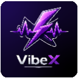

<div align="center">
  <a href="https://github.com/naeem5877/VibeX">
    
  </a>
  <br />
  <br />

  <h1>VibeX Extension</h1>
  
  <p>
    <strong>A modern, privacy-first browser extension for an enhanced Instagram experience.</strong>
  </p>
  
  <p>
    High-fidelity volume control, instant video downloads, and music recognition — integrated seamlessly into Instagram. Locally powered, ad-free, and open-source.
  </p>

  <p>
    <a href="https://github.com/naeem5877/VibeX">
      
    </a>
    <a href="https://vibedownloader.vercel.app">
      
    </a>
  </p>

  <p>
    <a href="https://github.com/naeem5877/VibeX/actions">
      
    </a>
    <a href="https://github.com/naeem5877/VibeX/releases">
      
    </a>
  </p>
</div>

<br />

---

## 🌟 Why VibeX?

VibeX is built to solve the frustrations of the modern web: intrusive ads, clunky interfaces, and restricted downloads. It brings a **Dynamic Island** style interface to Instagram, providing powerful tools exactly where you need them.

<div align="center">

### 🚫 No Ads • 🔒 Privacy-First • ✨ Smooth UI

</div>

---

## ✨ Key Features

<table>
<tr>
<td width="50%">

### 🔊 Precision Volume Control
Override Instagram's default mute/unmute with a high-fidelity volume slider (0-100%). Supports horizontal and vertical layouts.

### 📥 One-Click Downloads
Download any Reel, Post, or Story video instantly. No external websites, no ads, no trackers.

### 🎵 Music Recognition
Identify any song playing in a video using the integrated Shazam-powered engine. Get titles, artists, and streaming links.

</td>
<td width="50%">

### 🏝️ Dynamic Island UI
A sleek, reactive interface that stays out of your way and appears only when you need it.

### ⚡ Lightning Fast
Built with React and Vite for maximum performance and minimal memory footprint.

### 📱 Responsive Layouts
Adapts to Instagram's new feed updates with a specialized vertical mode for the home page.

### 🛑 Fully Open Source
Transparency you can trust. No hidden tracking, no data mining.

</td>
</tr>
</table>

---

## 🖼️ Screenshots

<div align="center">
  
</div>

## 📥 Installation

### 🚀 Official Stores

Get VibeX directly from your browser's official store for automatic updates:

<p>
  <a href="https://microsoftedge.microsoft.com/addons/detail/vibex-instagram-enhance/epbadfedljegkclgdelfngicbnnoikho">
    
  </a>
  <a href="https://addons.mozilla.org/en-US/firefox/addon/vibex-instagram/">
    
  </a>
</p>

---

### 🔧 Manual Installation (Chrome, Brave, etc.)

For browsers like **Google Chrome**, **Brave**, or other Chromium-based browsers, use the manual method:

1. Download the latest source code from the [**Releases**](https://github.com/naeem5877/VibeX/releases) page.
2. Unzip the file to a folder on your computer.
3. Open your browser and go to the extensions page:
   - **Chrome**: `chrome://extensions/`
   - **Brave**: `brave://extensions/`
4. Enable **Developer Mode** (usually a toggle in the top-right).
5. Click **Load unpacked** and select the `dist` folder from your unzipped directory.
6. Refresh Instagram and enjoy the VibeX experience!

---

## 🛠️ For Developers

Built with: **React**, **TypeScript**, **Vite**, and **Framer Motion**.

### Local Development

```bash
# Clone the repository
git clone https://github.com/naeem5877/VibeX.git

# Navigate to the project directory
cd VibeX

# Install dependencies
npm install

# Start development build
npm run dev

# Build for production
npm run build
```

---

## 🤝 Contributing

We love contributions! Whether it's fixing a bug, adding a feature, or improving documentation:

1. **Fork** the repository.
2. Create your **feature branch** (`git checkout -b feature/cool-new-thing`).
3. **Commit** your changes (`git commit -m 'Add cool new thing'`).
4. **Push** to the branch (`git push origin feature/cool-new-thing`).
5. Open a **Pull Request**.

---

## 📄 License & Brand Usage

### Code License

This project is licensed under the **GNU GPL v3.0**.

### ⚠️ Important Notice

**The VibeX name, logo, and branding are reserved.**

If you fork or modify this project:
- ❌ You **MUST** rename the project (do not use "VibeX").
- ❌ You **MUST** use a different logo.
- ❌ You **MUST NOT** sell the product or add any form of subscription/monetization.
- ❌ You **MUST** keep the project open-source under GPL v3.0.

This ensures that users can trust official builds and that the project remains free for everyone.

---

## 📞 Support

- 🐛 **Found a bug?** [Open an issue](https://github.com/naeem5877/VibeX/issues)
- 💡 **Feature idea?** [Start a discussion](https://github.com/naeem5877/VibeX/discussions)
- ⭐ **Loving VibeX?** Give us a star on GitHub!

---

<div align="center">
  
### Made with ❤️ by [Naeem](https://github.com/naeem5877)

**Stay tuned for more updates!**

<sub>© 2026 VibeX. Released under GPL v3.0 with Brand Restrictions.</sub>

</div> 
